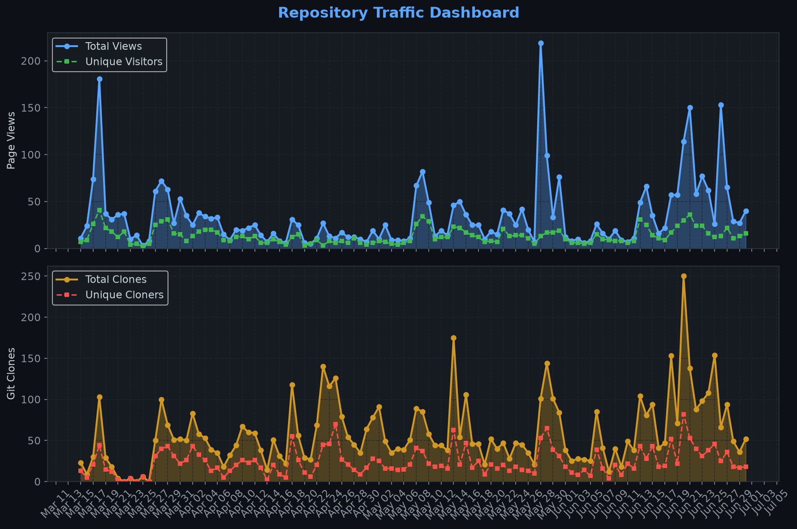
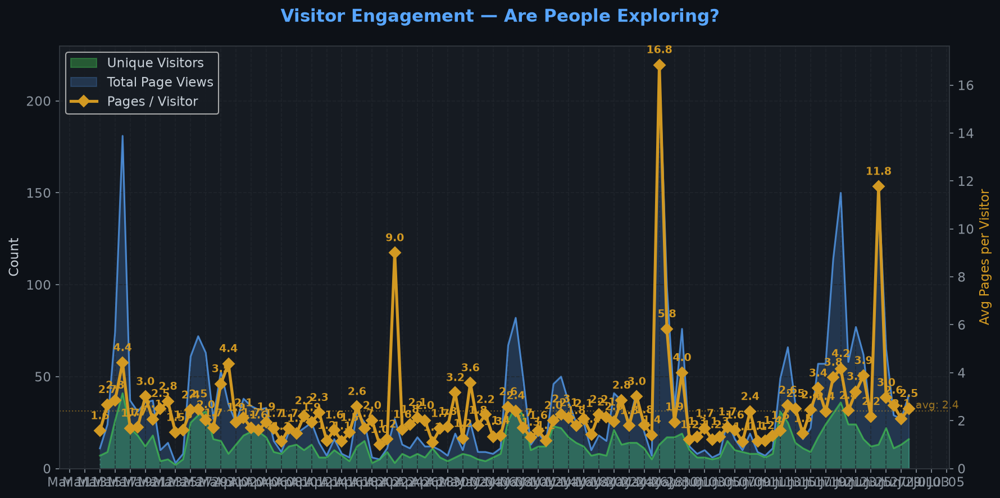
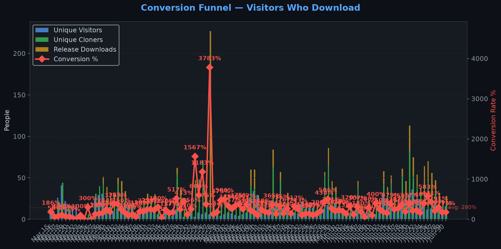
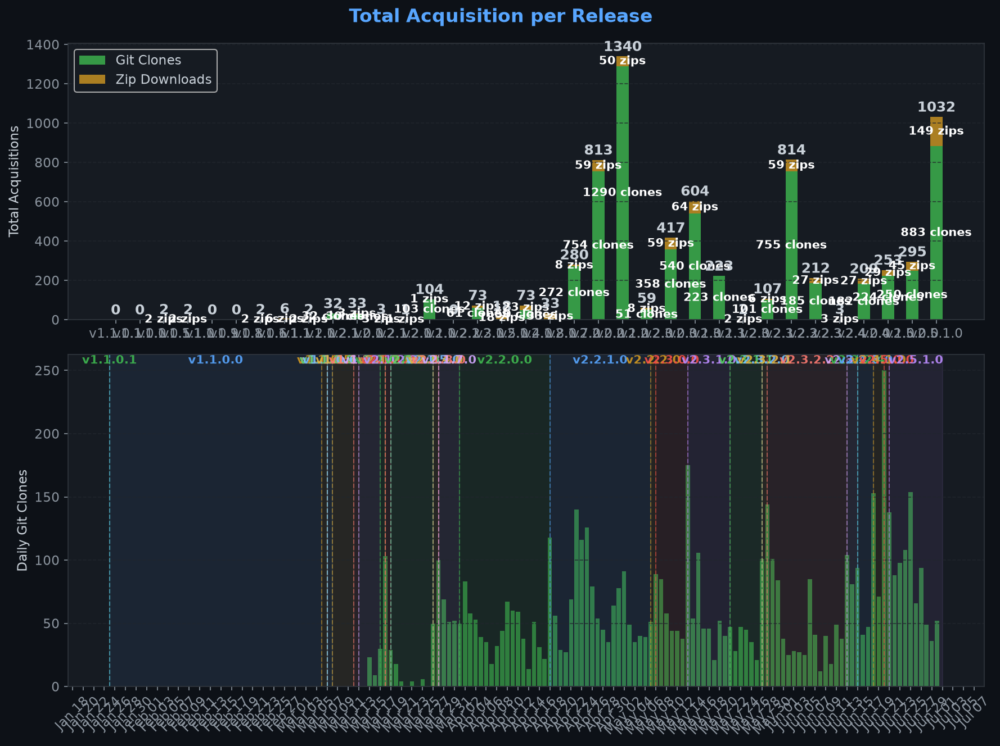
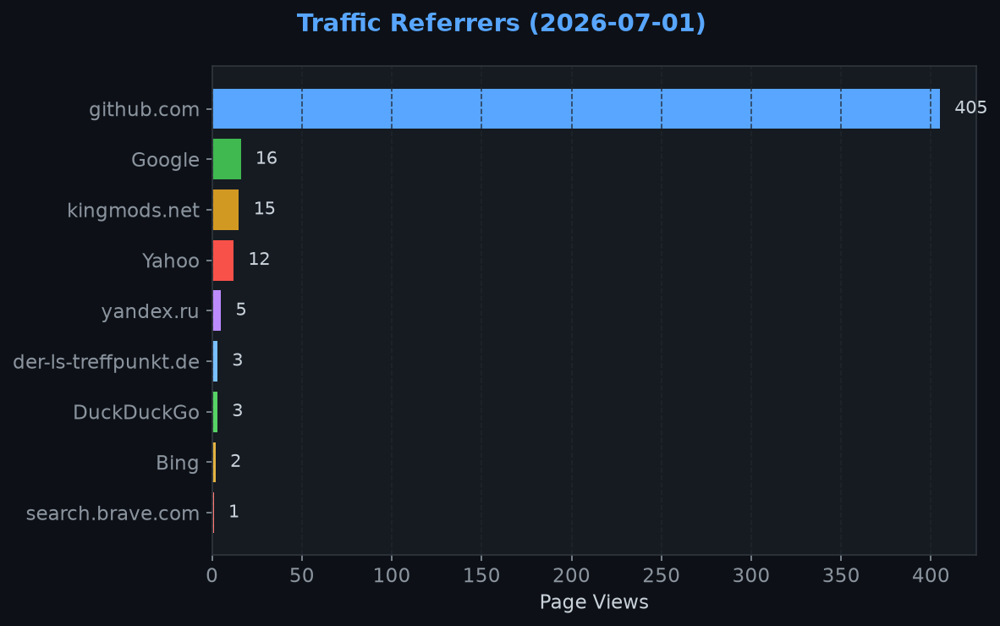
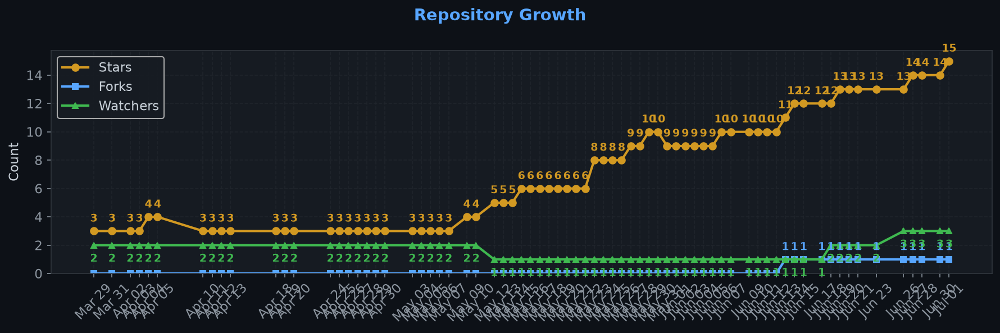

# Repository Traffic Dashboard

**Last updated:** 2026-07-01T12:34:30Z
**Days tracked:** 72 | **Download snapshots:** 403 (hourly)

---

## Views & Clones (14-day window, preserved forever)

| Metric | 14-Day Total | Unique |
|--------|-------------|--------|
| Page Views | 937 | 151 |
| Git Clones | 1404 | 440 |

> **Engagement:** 6.2 pages per visitor (14-day avg)

---

## Visitor Engagement

> Higher = visitors exploring more pages. 1.0 = bounce. 3.0+ = deeply engaged.

---

## Conversion Funnel

> **14-day conversion:** 1139 of 151 visitors cloned or downloaded (**754.3%**)
>
> Unique cloners: 440 | Release downloads: 699

---

## Total Acquisition per Release (Downloads + Clones)

| Channel | Count |
|---------|-------|
| Zip Downloads | 699 |
| Git Clones (14-day) | 1404 |
| **Total Acquisitions** | **2103** |

---

## Referrers

| Source | Views | Unique |
|--------|-------|--------|
| github.com | 405 | 102 |
| Google | 16 | 12 |
| kingmods.net | 15 | 8 |
| Yahoo | 12 | 1 |
| yandex.ru | 5 | 1 |
| der-ls-treffpunkt.de | 3 | 2 |
| DuckDuckGo | 3 | 1 |
| Bing | 2 | 2 |
| search.brave.com | 1 | 1 |

---

## Repository Growth

| Metric | Current |
|--------|---------|
| Stars | 15 |
| Forks | 1 |
| Watchers | 3 |

---

## Top Pages (14-day)

| Page | Views | Unique |
|------|-------|--------|
| `/Realistic-Farming/FS25_FarmTablet` | 293 | 110 |
| `/TheCodingDad-TisonK/FS25_FarmTablet` | 106 | 47 |
| `/Realistic-Farming/FS25_FarmTablet/releases` | 56 | 20 |
| `/Realistic-Farming/FS25_FarmTablet/releases/tag/v2.5.1.0` | 46 | 33 |
| `/Realistic-Farming/FS25_FarmTablet/issues` | 39 | 11 |
| `/TheCodingDad-TisonK/FS25_FarmTablet/releases` | 35 | 13 |
| `/Realistic-Farming/FS25_FarmTablet/issues/93` | 31 | 7 |
| `/TheCodingDad-TisonK/FS25_FarmTablet/releases/tag/v2.5.0.0` | 15 | 15 |
| `/Realistic-Farming/FS25_FarmTablet/releases/tag/v2.5.0.0` | 15 | 14 |
| `/TheCodingDad-TisonK/FS25_FarmTablet/releases/tag/v2.4.1.0` | 15 | 12 |

---

## Data Files

| File | Description | Granularity |
|------|-------------|-------------|
| [daily.json](daily.json) | Views & clones per day (never expires) | Daily |
| [downloads.json](downloads.json) | Release download snapshots | Hourly |
| [referrers.json](referrers.json) | Referrer snapshots | Daily |
| [metadata.json](metadata.json) | Stars, forks, watchers | Daily |
| [stats.json](stats.json) | Combined legacy snapshots | 6-hourly |

---
*Hourly download tracking + full dashboard with engagement metrics every 6 hours*
*Auto-generated by [traffic-stats.yml](../../.github/workflows/traffic-stats.yml)*
