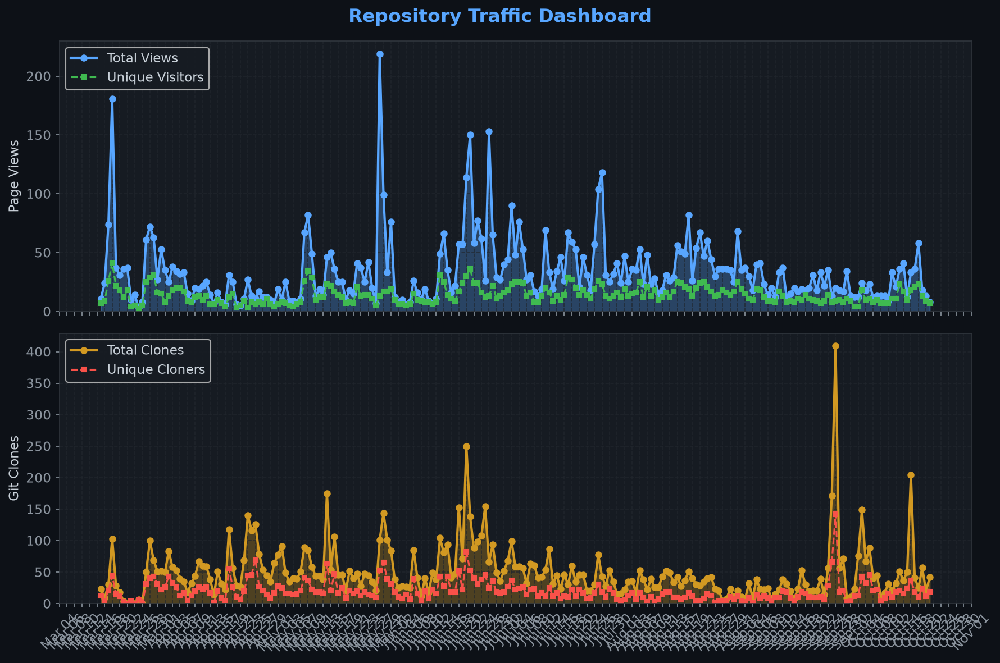
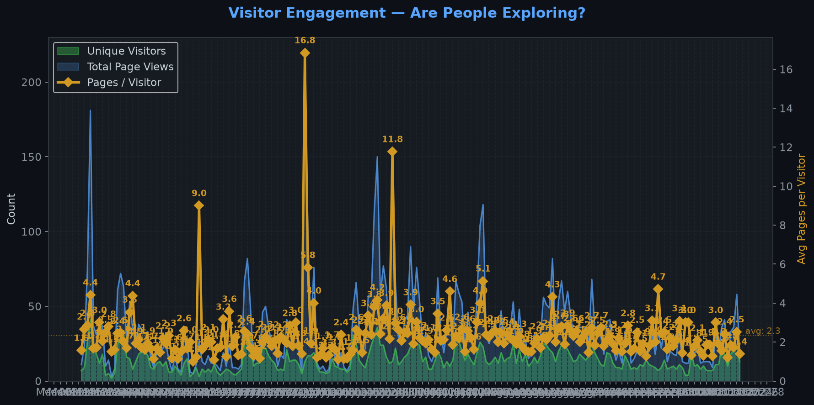
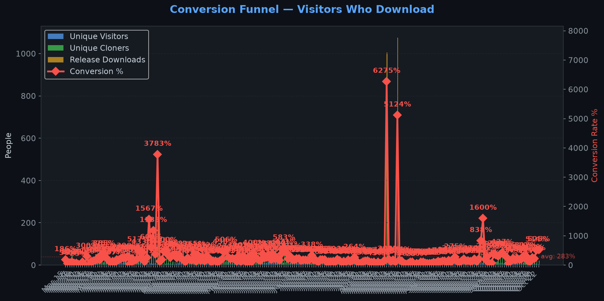
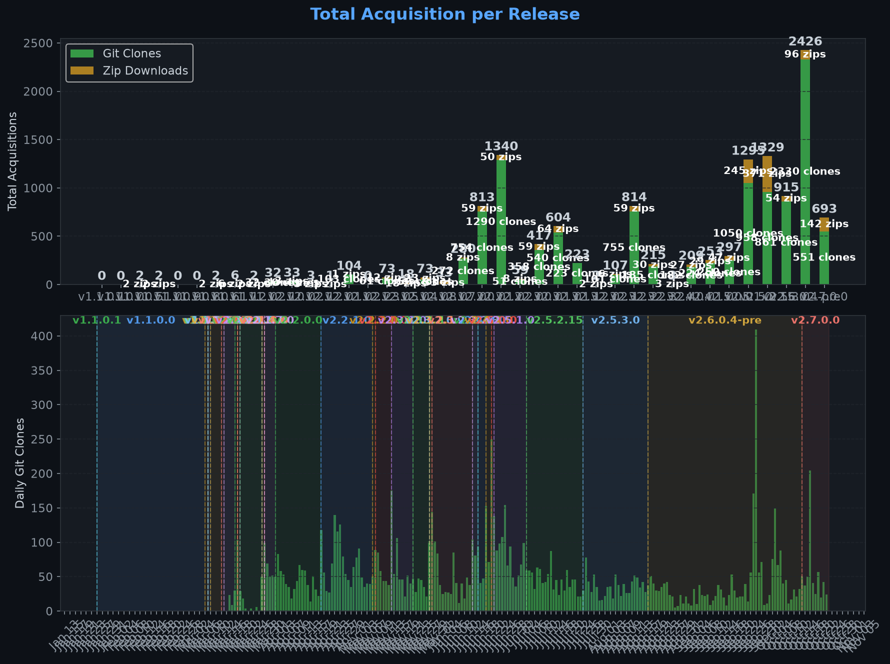
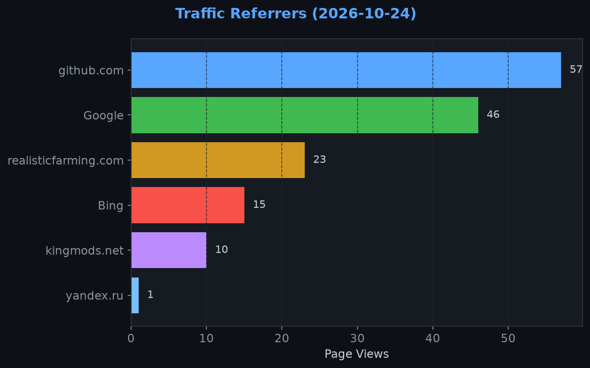
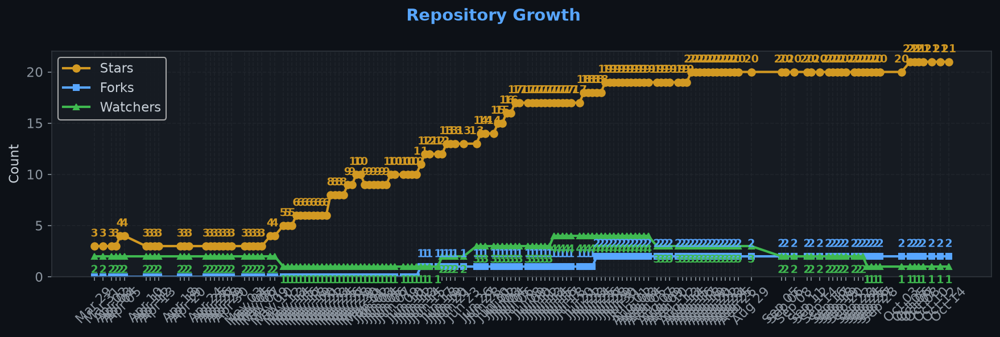

# Repository Traffic Dashboard

**Last updated:** 2026-10-31T18:17:26Z
**Days tracked:** 162 | **Download snapshots:** 982 (hourly)

---

## Views & Clones (14-day window, preserved forever)

| Metric | 14-Day Total | Unique |
|--------|-------------|--------|
| Page Views | 401 | 218 |
| Git Clones | 475 | 159 |

> **Engagement:** 1.8 pages per visitor (14-day avg)

---

## Visitor Engagement

> Higher = visitors exploring more pages. 1.0 = bounce. 3.0+ = deeply engaged.

---

## Conversion Funnel

> **14-day conversion:** 1722 of 218 visitors cloned or downloaded (**789.9%**)
>
> Unique cloners: 159 | Release downloads: 1563

---

## Total Acquisition per Release (Downloads + Clones)

| Channel | Count |
|---------|-------|
| Zip Downloads | 1563 |
| Git Clones (14-day) | 475 |
| **Total Acquisitions** | **2038** |

---

## Referrers

| Source | Views | Unique |
|--------|-------|--------|
| github.com | 69 | 55 |
| Google | 51 | 38 |
| aocr.org | 50 | 50 |
| realisticfarming.com | 40 | 31 |
| Bing | 12 | 10 |
| DuckDuckGo | 1 | 1 |
| Yahoo | 1 | 1 |
| kingmods.net | 1 | 1 |
| ya.ru | 1 | 1 |
| yandex.ru | 1 | 1 |

---

## Repository Growth

| Metric | Current |
|--------|---------|
| Stars | 23 |
| Forks | 3 |
| Watchers | 1 |

---

## Top Pages (14-day)

| Page | Views | Unique |
|------|-------|--------|
| `/Realistic-Farming/FS25_FarmTablet` | 184 | 121 |
| `/Realistic-Farming/FS25_FarmTablet/releases` | 65 | 50 |
| `/Realistic-Farming/FS25_FarmTablet/releases/tag/v2.7.0.0` | 34 | 32 |
| `/Realistic-Farming/FS25_FarmTablet/blob/main/.github/images/ft-home.png` | 12 | 12 |
| `/Realistic-Farming/FS25_FarmTablet/blob/main/.github/images/ft-lockscreen.png` | 8 | 7 |
| `/Realistic-Farming/FS25_FarmTablet/blob/main/.github/images/ft-settings.png` | 7 | 7 |
| `/Realistic-Farming/FS25_FarmTablet/issues/52` | 7 | 7 |
| `/Realistic-Farming/FS25_FarmTablet/issues` | 7 | 5 |
| `/Realistic-Farming/FS25_FarmTablet/blob/main/.github/images/ft-dashboard.png` | 6 | 5 |
| `/Realistic-Farming/FS25_FarmTablet/issues/51` | 5 | 5 |

---

## Data Files

| File | Description | Granularity |
|------|-------------|-------------|
| [daily.json](daily.json) | Views & clones per day (never expires) | Daily |
| [downloads.json](downloads.json) | Release download snapshots | Hourly |
| [referrers.json](referrers.json) | Referrer snapshots | Daily |
| [metadata.json](metadata.json) | Stars, forks, watchers | Daily |
| [stats.json](stats.json) | Combined legacy snapshots | 6-hourly |

---
*Hourly download tracking + full dashboard with engagement metrics every 6 hours*
*Auto-generated by [traffic-stats.yml](../../.github/workflows/traffic-stats.yml)*
