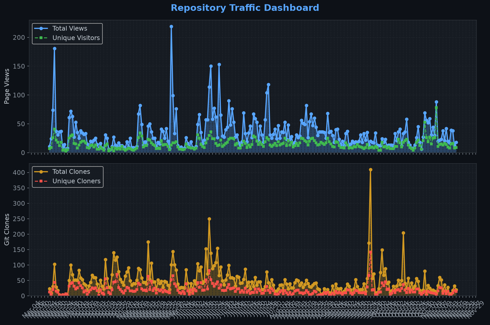
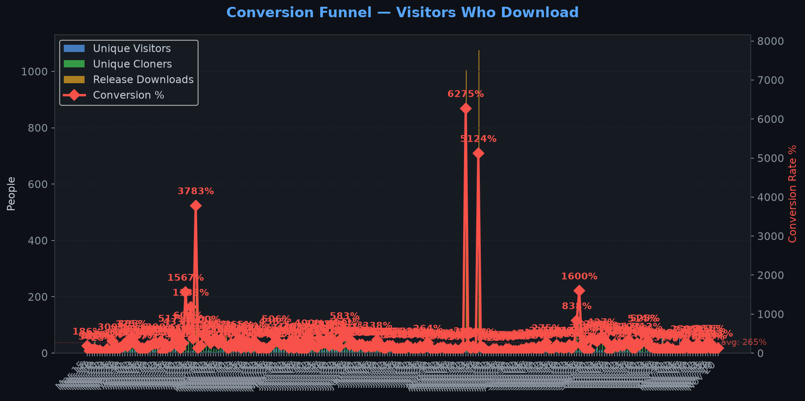

# Repository Traffic Dashboard

**Last updated:** 2026-11-22T01:00:10Z
**Days tracked:** 173 | **Download snapshots:** 1041 (hourly)

---

## Views & Clones (14-day window, preserved forever)

| Metric | 14-Day Total | Unique |
|--------|-------------|--------|
| Page Views | 365 | 155 |
| Git Clones | 322 | 138 |

> **Engagement:** 2.3 pages per visitor (14-day avg)

---

## Visitor Engagement

> Higher = visitors exploring more pages. 1.0 = bounce. 3.0+ = deeply engaged.

---

## Conversion Funnel

> **14-day conversion:** 1824 of 155 visitors cloned or downloaded (**1176.7%**)
>
> Unique cloners: 138 | Release downloads: 1686

---

## Total Acquisition per Release (Downloads + Clones)

| Channel | Count |
|---------|-------|
| Zip Downloads | 1686 |
| Git Clones (14-day) | 322 |
| **Total Acquisitions** | **2008** |

---

## Referrers

| Source | Views | Unique |
|--------|-------|--------|
| github.com | 78 | 54 |
| Google | 58 | 46 |
| realisticfarming.com | 14 | 12 |
| Bing | 6 | 5 |
| search.brave.com | 2 | 1 |
| DuckDuckGo | 1 | 1 |
| Yahoo | 1 | 1 |
| ya.ru | 1 | 1 |
| yandex.by | 1 | 1 |

---

## Repository Growth

| Metric | Current |
|--------|---------|
| Stars | 23 |
| Forks | 3 |
| Watchers | 1 |

---

## Top Pages (14-day)

| Page | Views | Unique |
|------|-------|--------|
| `/Realistic-Farming/FS25_FarmTablet` | 217 | 119 |
| `/Realistic-Farming/FS25_FarmTablet/releases/tag/v2.7.0.0` | 40 | 37 |
| `/Realistic-Farming/FS25_FarmTablet/releases` | 30 | 29 |
| `/Realistic-Farming/FS25_FarmTablet/blob/main/.github/images/ft-lockscreen.png` | 14 | 12 |
| `/Realistic-Farming/FS25_FarmTablet/blob/main/.github/images/ft-home.png` | 13 | 12 |
| `/Realistic-Farming/FS25_FarmTablet/blob/main/.github/images/ft-settings.png` | 11 | 9 |
| `/Realistic-Farming/FS25_FarmTablet/blob/main/.github/images/ft-dashboard.png` | 10 | 8 |
| `/Realistic-Farming/FS25_FarmTablet/tree/main` | 5 | 3 |
| `/Realistic-Farming/FS25_FarmTablet/issues/77` | 4 | 4 |
| `/Realistic-Farming/FS25_FarmTablet/blob/main/icon.dds` | 2 | 2 |

---

## Data Files

| File | Description | Granularity |
|------|-------------|-------------|
| [daily.json](daily.json) | Views & clones per day (never expires) | Daily |
| [downloads.json](downloads.json) | Release download snapshots | Hourly |
| [referrers.json](referrers.json) | Referrer snapshots | Daily |
| [metadata.json](metadata.json) | Stars, forks, watchers | Daily |
| [stats.json](stats.json) | Combined legacy snapshots | 6-hourly |

---
*Hourly download tracking + full dashboard with engagement metrics every 6 hours*
*Auto-generated by [traffic-stats.yml](../../.github/workflows/traffic-stats.yml)*
